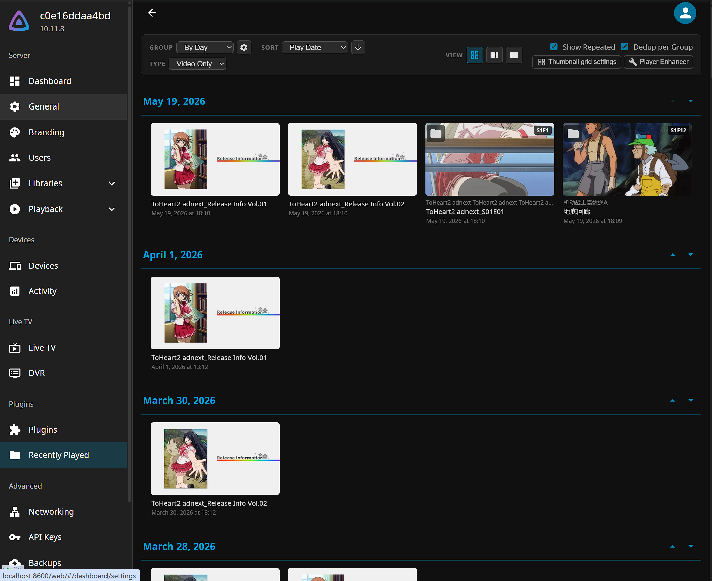
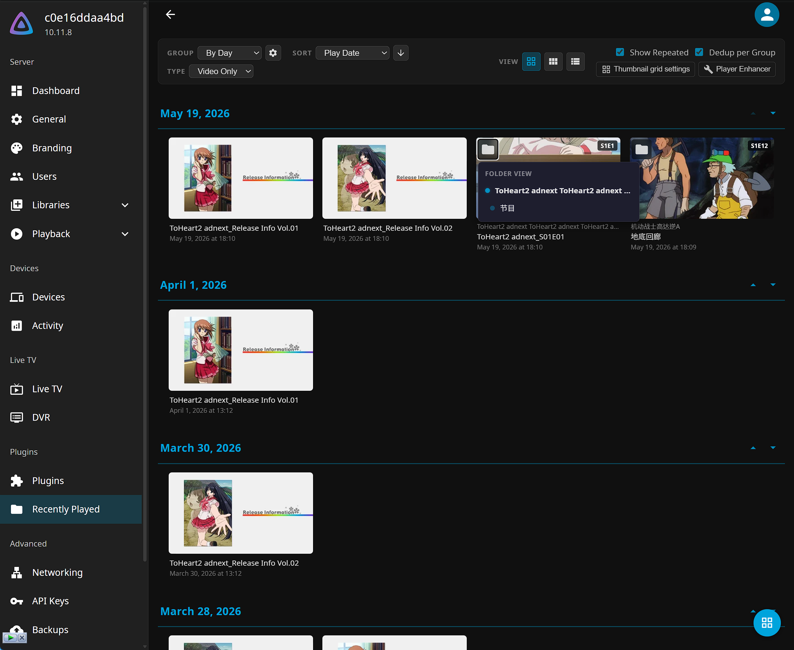
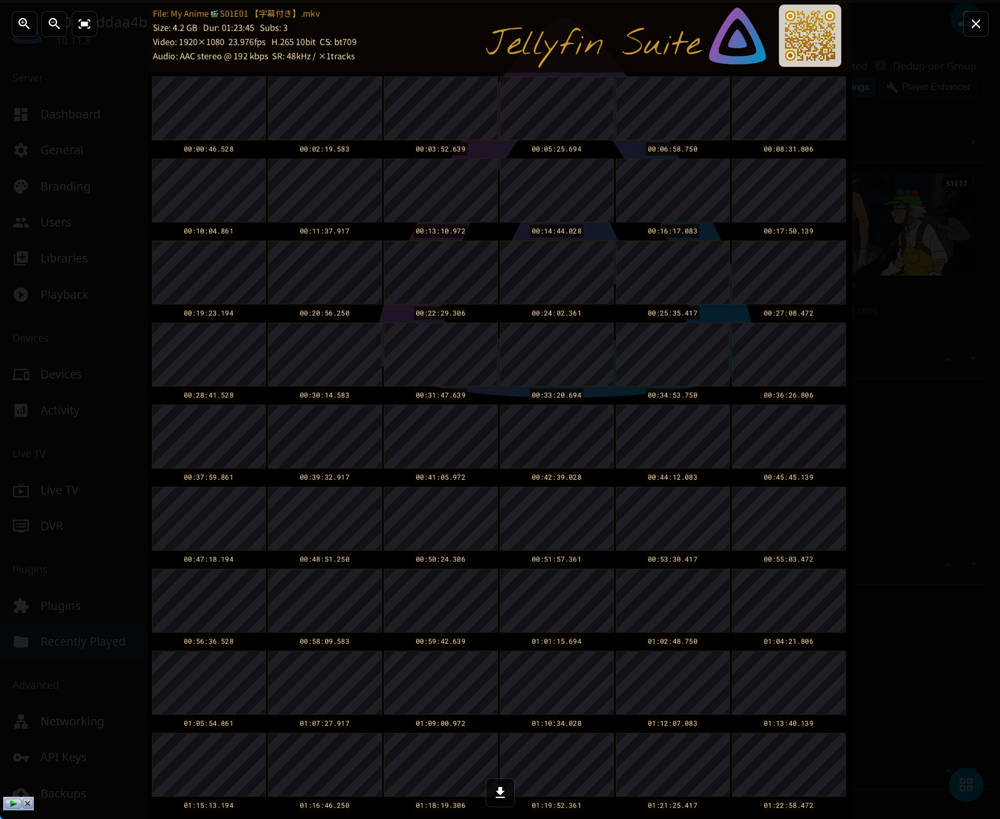
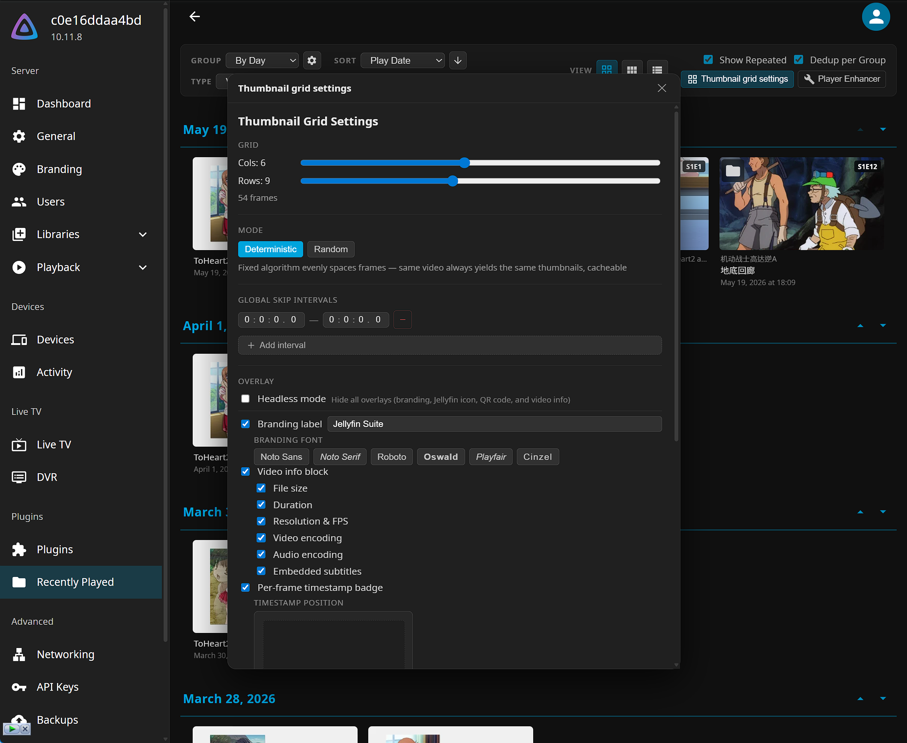
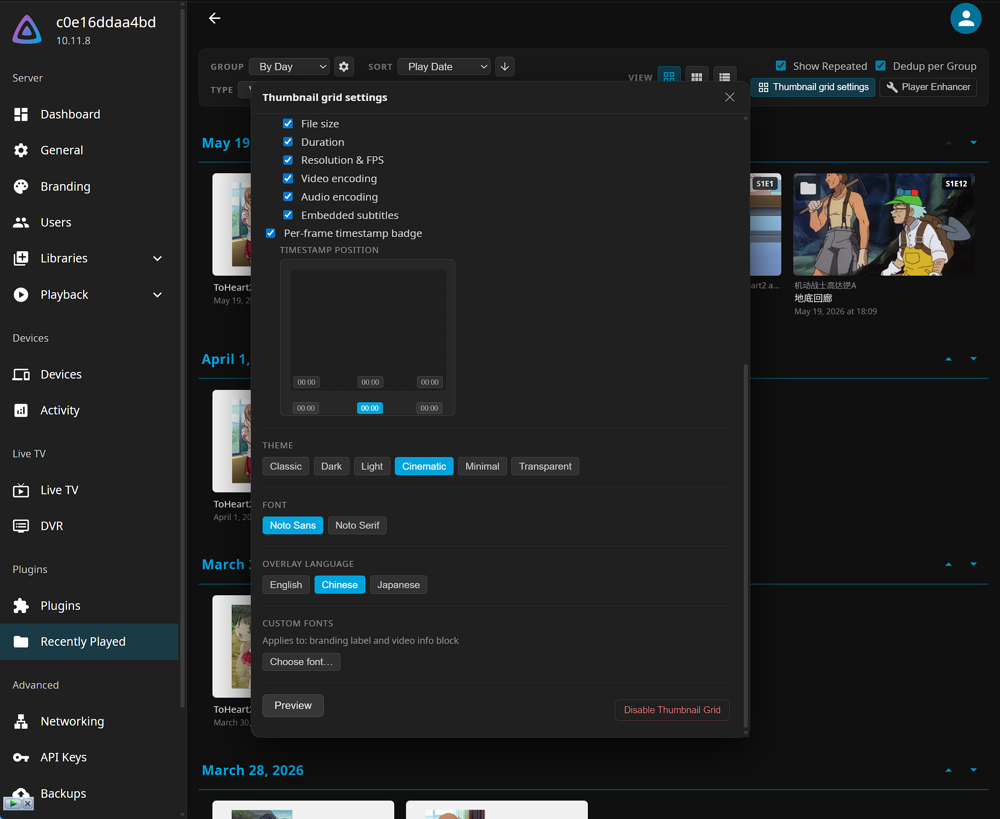
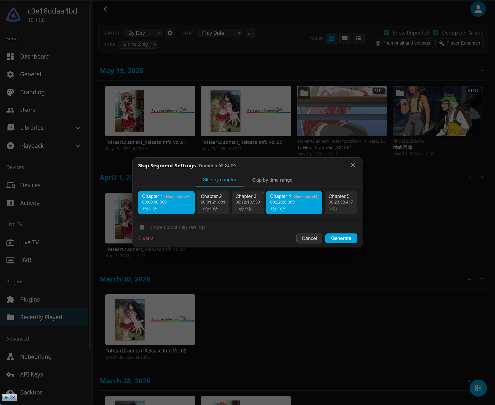
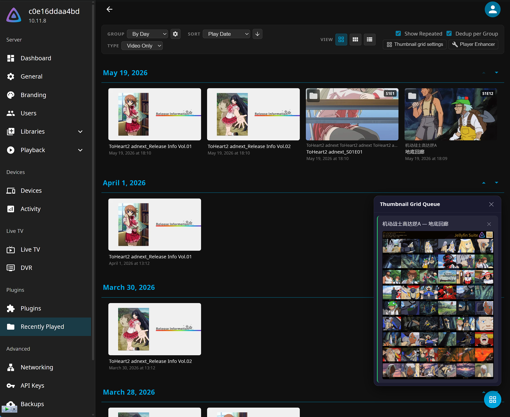
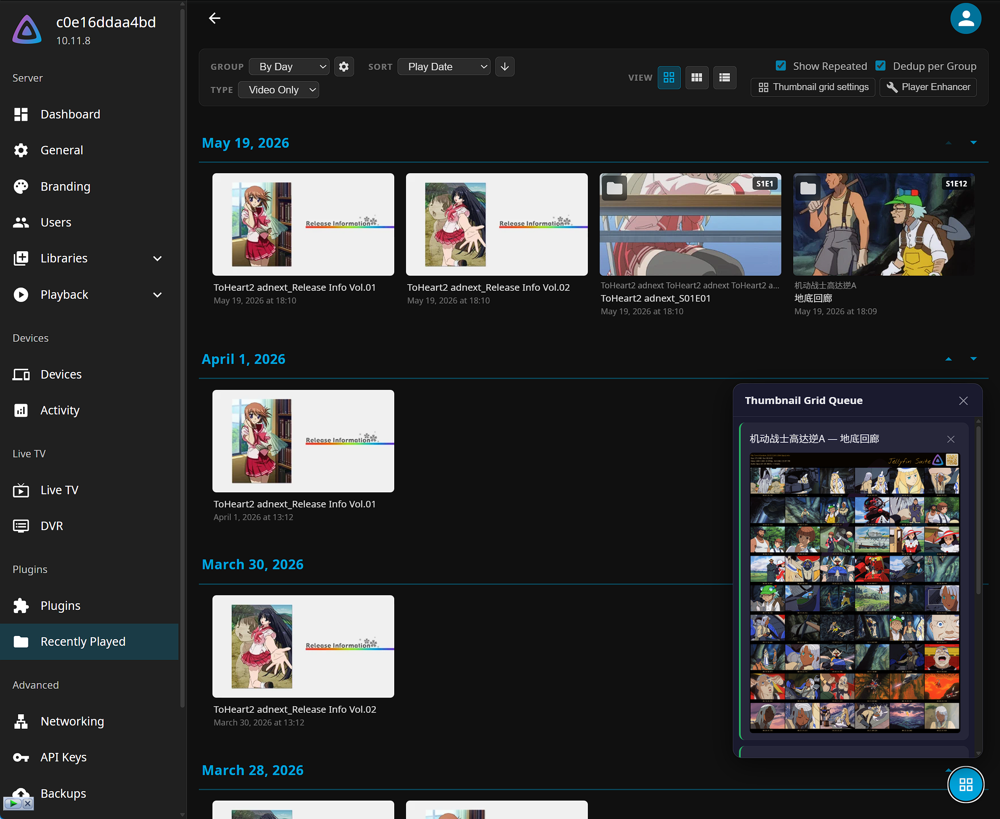
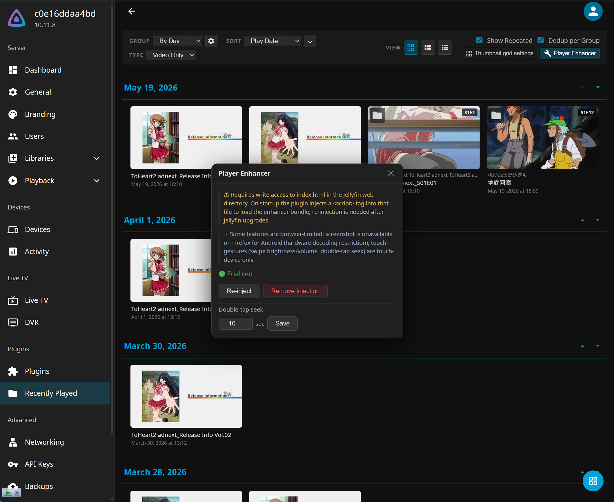
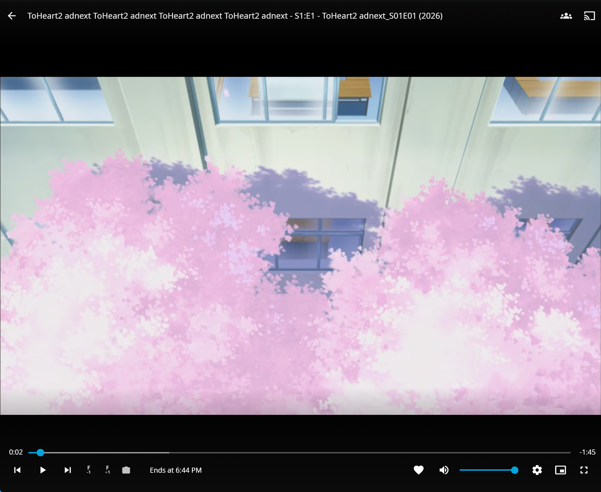

# Jellyfin Suite

Jellyfin 插件套件：最近播放视图、截图墙生成器与网页播放器增强。

[English](README.md)

---

## 功能

### 最近播放视图

- **分组浏览**：按日 / 周 / 月 / 季 / 年分组展示播放记录
- **多种排序**：播放时间、标题、发行日期、添加日期、收藏优先
- **媒体筛选**：全部 / 视频 / 音频
- **去重模式**：隐藏重复播放记录；可独立开启「分组内去重」
- **剧集信息**：卡片显示系列名称及集数代码（S×E× / 特别篇显示 SP×）
- **智能链接**：系列名称跳转作品页，集标题跳转剧集页
- **文件夹视图**：点击卡片上的文件夹图标，弹出菜单显示该媒体所在目录及所有上级目录的快捷链接 — 支持缩略图、海报、列表三种视图 *（需在 Jellyfin 中启用：**管理后台 → 媒体库 → 显示 → 为媒体库项目显示文件夹视图**）*
- **视图模式**：缩略图（16:9）/ 海报（2:3）/ 列表
- **完整分页**：首页 / 上一页 / 跳转 / 下一页 / 末页，每页数量可配置
- **多语言界面**：English、简体中文、日本語

### 截图墙生成器

在 5 秒内连续点击**缩略图**视图按钮 7 次即可解锁。解锁后，每张视频卡片上会出现网格图标。

- **网格配置**：自由调节行数（1–10）和列数（1–12）；短视频自动仅显示满足每帧 ≥2 秒间隔的合法预设
- **抽帧模式**：确定性模式（相同视频始终生成相同截图墙，可缓存命中）或随机模式（每次随机抽取不同帧）
- **跳过区间**：支持按章节或自定义时间段跳过片头/片尾；一键快捷添加跳过开头/结尾 60s、90s；支持全局跳过预设（跨视频共享）；OP/ED 自动猜测启发式
- **叠加层**：可配置品牌标签、视频元信息区块（文件名、文件大小、分辨率与帧率、视频/音频编码、时长）、逐帧时间戳徽章（6 个位置可选）；徽章尺寸随缩略图宽度等比缩放（约 ¼ 格宽）
- **时间戳样式**：可选字体（Roboto Mono、Vollkorn 老式数字风格或任意上传的自定义字体）；可独立开关背景色块和阴影/轮廓效果；阴影色按主题预置，自动区分"有背景色块"与"文字直接浮在视频上"两种模式
- **主题**：Classic / Dark / Light / Cinematic / Minimal / Transparent — 各具独立配色方案
- **字体**：自动下载 Noto Sans、Noto Serif、Roboto、Oswald、Playfair Display、Cinzel、Vollkorn；支持上传自定义字体（TTF/OTF，自动识别 Latin 或 CJK）；品牌标签逐字符选用对应语言字体，正确渲染中英混排
- **QR 水印**：页眉区域嵌入指向插件 GitHub 仓库的渐变色 QR 码
- **Jellyfin 徽标**：半透明徽标合成至页眉区域
- **输出格式**：无损 WebP（透明主题支持 Alpha 通道）
- **任务队列**：右下角浮动组件，实时显示所有进行中和已完成的任务；每条任务显示进度条、缩略图预览、下载和删除操作
- **全屏查看器（Lightbox）**：鼠标滚轮缩放（以光标为锚点）、鼠标拖拽平移、触控拖拽平移、双指捏合缩放；支持下载和删除操作

### 网页播放器增强

自动注入 Jellyfin 网页播放器，无需任何配置。

- **帧步进**：四个按钮（|◁◁ |◁ ▷| ▷▷|）实现 −10帧 / −1帧 / +1帧 / +10帧 精准导航；帧率自动从 MediaInfo 获取；步进时自动暂停
- **截图**：一键下载当前视频帧为 PNG；可选叠加字幕（ASS 和 SRT）；纯客户端操作，不产生服务端文件
- **移动端双击快进/快退**：双击左侧三分之一快退，右侧三分之一快进，中间三分之一切换播放/暂停；快进/快退时长可在插件管理面板配置（默认 10 秒，仅触控设备）
- **移动端滑动控制**：左半屏上下滑动调节亮度（0–200%），右半屏调节音量（0–100%）；手势期间显示 OSD 百分比指示器（仅触控设备）
- **移动端长按加速**：播放时长按屏幕下方三分之一区域，以可配置的速率（1.25×–4×，默认 2×）加速播放，支持触觉反馈和 OSD 提示；按住同时左右拖动可实时 1× 速率精准 seek；松开拖动后自动恢复加速；速率可在插件管理面板配置（仅触控设备）

---

## 截图

### 最近播放视图

 

### 截图墙生成器



  

 

### 网页播放器增强

 

---

## 安装

### 通过插件仓库（推荐）

1. 打开 Jellyfin 管理后台 → **插件** → **仓库**
2. 添加仓库 URL：
   ```
   https://thelastfantasy.github.io/jellyfin-suite/manifest.json
   ```
3. 在**目录**中找到 **Jellyfin Suite**，点击安装
4. 重启 Jellyfin 服务

> **Jellyfin Suite + Fonts** 是目录中的独立条目，内置 Latin 字体包（Roboto、Oswald、Playfair Display、Cinzel），无需外网即可使用全部字体。适合无法访问互联网的服务器环境。

### 手动安装

1. 从 [Releases](https://github.com/thelastfantasy/jellyfin-suite/releases) 下载最新版本的 `.zip`
2. 解压到 Jellyfin 插件目录：
   - Linux：`/var/lib/jellyfin/plugins/JellyfinSuite/`
   - Windows：`%APPDATA%\Jellyfin\plugins\JellyfinSuite\`
   - Docker：`/config/plugins/JellyfinSuite/`
3. 重启 Jellyfin 服务

安装后，侧边栏会出现**最近播放**入口。

### 播放器增强 — Docker/Linux 权限说明

网页播放器增强功能在服务启动时修改 Jellyfin 的 `index.html`。如果 Jellyfin 以非 root 用户运行（Unraid、TrueNAS 或自定义 Docker 环境中常见），需确保该文件对 Jellyfin 进程可写。安装后**执行一次**以下命令，将 `568:568` 替换为实际的 Jellyfin UID:GID：

```bash
docker exec -u root $(docker ps --filter name=jellyfin --format '{{.Names}}') \
  ls /jellyfin/jellyfin-web/index.html >/dev/null && \
  chown 568:568 $(docker inspect \
    $(docker ps --filter name=jellyfin --format '{{.Names}}') \
    --format '{{.GraphDriver.Data.MergedDir}}')/jellyfin/jellyfin-web/index.html
```

若播放器增强未注入成功（播放器中看不到帧步进按钮），请检查 Jellyfin 进程是否有权限写入 `index.html`。

---

## 从 Jellyfin Recents 迁移

如果你之前安装的是 **Jellyfin Recents** 插件，请按以下步骤迁移到 Jellyfin Suite。

> 两个插件内部 GUID 相同，同时安装可能导致冲突——请先卸载旧插件，再安装新插件。

1. **移除旧仓库**：管理后台 → **插件** → **仓库** → 删除旧条目：
   ```
   https://thelastfantasy.github.io/jellyfin-recents/manifest.json
   ```
2. **卸载 Jellyfin Recents**：**插件** → **我的插件** → 找到 *Jellyfin Recents*（或 *Jellyfin Recents + Fonts*）→ 卸载
3. **重启 Jellyfin**，等待卸载完成
4. **添加新仓库**（见上方安装说明），在目录中安装 **Jellyfin Suite**
5. **再次重启 Jellyfin**

播放历史和插件配置保存在 Jellyfin 数据库和数据目录中，迁移不会影响这些数据。

---

## 自定义字体

插件首次使用截图墙功能时会自动下载 Noto Sans JP、Noto Serif JP（需要外网）。Latin 字体（Roboto、Oswald、Playfair Display、Cinzel）也会自动下载。

如需使用自己的字体，可通过截图墙设置面板上传，或手动放置到以下目录：

```
<Jellyfin 数据目录>/plugins/JellyfinSuite/fonts/
  custom-MyFont.ttf     ← 通过设置面板上传
```

支持格式：TTF、OTF（不支持 TTC 集合字体）。插件从字体文件内部读取字体族名称，文件名在上传时自动生成。

---

## 兼容性

| 插件版本 | Jellyfin 最低版本 |
|----------|------------------|
| 1.x      | 10.10.0          |

---

## 开发

```bash
# 运行全套测试
make test

# 构建并部署到本地 Jellyfin 开发容器
make update
```

### 前端开发服务器

```bash
cd src/frontend
npm install
npm run dev
```

复制 `.env.example` 为 `.env` 并配置 Jellyfin 地址：

```
VITE_JELLYFIN_URL=http://localhost:8096
```

### 播放器增强

播放器增强是独立的 Vite bundle，在服务启动时注入 Jellyfin 的 `index.html`：

```bash
make build-enhancer   # 构建 src/player-enhancer → JellyfinSuite.Plugin/Web/
```

或直接运行：

```bash
cd src/player-enhancer
npm install
npm run build
```

### 截图墙生成器

Rust 截图墙生成器二进制（`poster-gen`）通过 Docker 单独构建：

```bash
make build-poster-gen      # Linux 二进制（通过 Docker）
make build-poster-gen-win  # Windows 二进制（本地构建）
```

---

## AI 声明

本项目主要借助 AI 语言模型（Anthropic 的 Claude）开发完成。依据 [Jellyfin 的 LLM 政策](https://jellyfin.org/docs/general/contributing/llm-policies)，特此声明，以便用户自行判断是否使用本插件。
